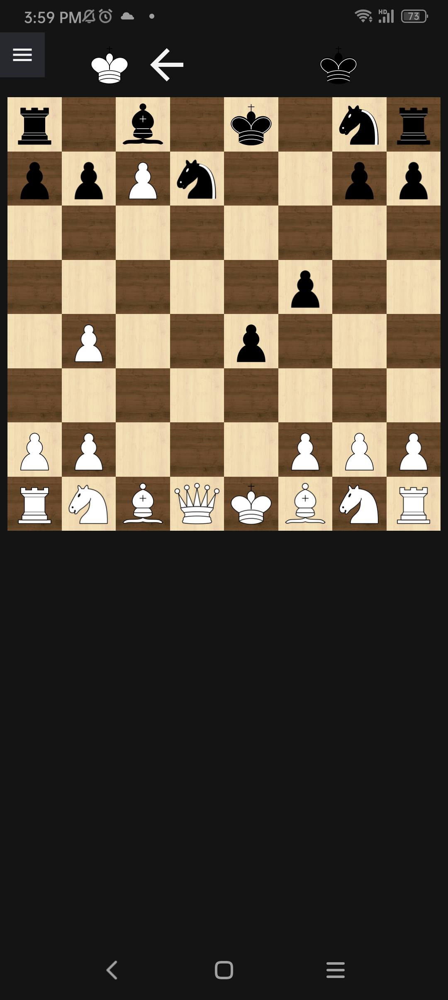

# Chess

This app was built forking the project presented at the video
"[Building a Chess GUI with Fyne](https://www.youtube.com/watch?v=zlPDWBLhn6c)".

I only used it to built a simple APK package to install the application on my
cell phone.

# Installing

To install fyne follow the instructions at https://developer.fyne.io/started/

If you are willing to built packages for your android device you should install
the Android SDK and NDK as well before procede. For more reference check this
tutorial: [Golang Fyne: How to compile \*apk for Android | Golang Fyne tutorial](https://www.youtube.com/watch?v=4S-AQlV1pcw).

PS: Of course you should have GoLang installed on your environment;

# Building

More info on multi-platform builds can be found on https://developer.fyne.io/started/cross-compiling

## Building for Android

Just run the command below

    $ fyne package -os android -appID com.example.rstriquer.go-fyne-chess-demo

PS: Sometimes it will be necessary to install some dependencies. Like in my case I
needed to install glfw to my env, them I just added `go get fyne.io/fyne/v2/internal/driver/glfw@v2.3.5`
and it was good to go. Those dependencies will be shown to you if necessary
when you run the command.

The below command will create an apk file named `go_fyne_chess_demo.apk` you
can send to your device and install it like any other application.

## Building for your local operating system

Just run the command `fyne build`. It will create a file named "go_fyne_chess_demo"
of "go_fyne_chess_demo.exe" and so on depending on your local operating system.

# Screenshot

## Android version

## Desktop version

